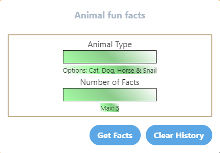
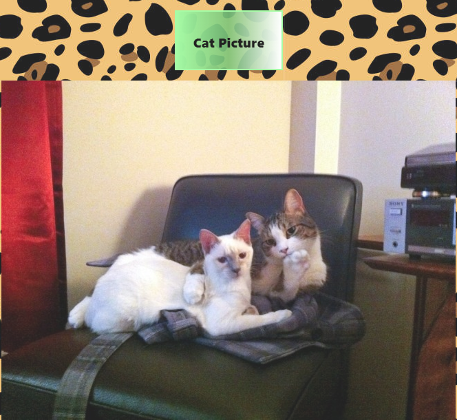

# PROJECT1 Cat Picture and Animal Fun Facts
## Project1 collaborators: 
* project manager: Kate Neuse
* collaborators: Jacob Carpenter and Chue Chang
## Assignment 
* Jacob was assign to obtain the two API used for application. Making sure the api is good and running without breaking. 
* Chue was assign to set up the wireframe and debug code as to why certain code are not working.
* Kate was assign to link up HTML files and Javascript files together as well as working on styling of application. 
## Why animal facts and cat picture?
* The common interest between the collaborators are love for animals and cat. Everyone can easily come to a conclusion when animals and cat was mention. 
## CSS framework
In this project, [Tailwind](https://tailwindui.com/) was choosen to create this application. Some of the component from the orginal is adjusted. On the other hand, [Bulma](https://bulma.io/) was selected to be a back-up framework. In Project1, Bulma is not active. 
## API
### Animal Fun Facts
* The main component of this project is the "Animal fun facts" user input box. 
* This feature uses API provide from [cat-fact.herokuapp.com](https://cat-fact.herokuapp.com). 
* The code are written in the [catfacts.js](catfacts.js) file. 
* The site provide an option of four animals which are cat, dog, horse and snail. The "Animal fun facts" feature allow user to type which animal facts will be generated as well as how many facts to display up to 5 max. 
* There are two button feature. 
    * One is the "Get Facts" button which will generate fun facts depending on user input. A modal will pop up to display the facts. When user close the modal or the pop up, everything will be delete. The reasoning was to provide a clean pop up when user generate a new search. 
    * Part of the feature is to track the history of user input. "Clear History" button was coded to clear all user input history. 
* Here is the display of how it will look like. 
### Random cat picture generator
* One other feature in Project1 was the random cat picture generator. This feature will display one random picture using API from [thecatapi.com](https://docs.thecatapi.com/) when the "Cat Picture" is clicked. 
* Code was also written to only show one picture each time user click on button. 
* Although, it say cat picture, but application sometime will also generate gif as well. 
* The display shown is an example of how the "Cat Picture" feature look.  
## Future Development 
* Provide more than just cat picture. Include all four animal or more. 
* Give user option to choose between picture and gif or both. 
* Probably orangize fun facts into individual slot rather than all in one container. 
## Link to page or application. 
* Here is the link to go directly to the project1 application or page. [Project1](https://kateneuse.github.io/project1/)

